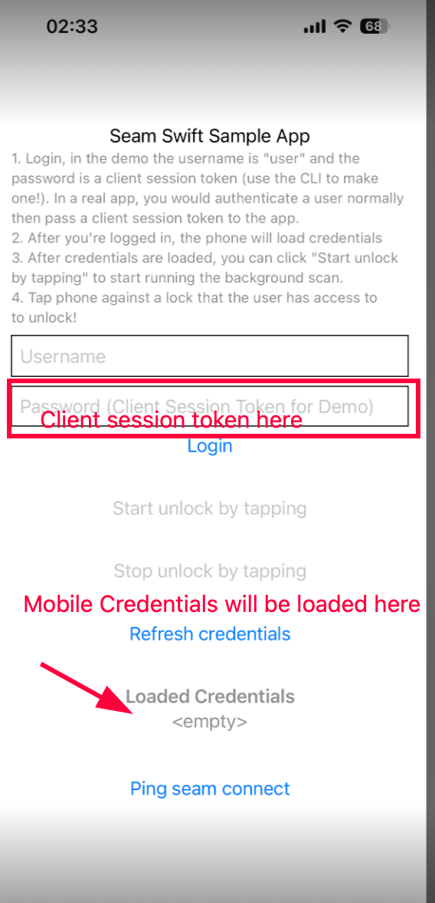

## Complete E2E flow to Unlock a Visionline Lock

1. Make sure your assa abloy and visionline acs systems are connected to the workspace. 
2. Run the go script. The go script is the complete working flow to create a user identity, acs credential, and granting access to acs entrances. 
3. Once the script is complete it will print out a client session. Save the `client_session_token`
4. Load up the sample swift app on a phone. The SeamSDK isn't built for simulators yet.
5. Enter the token into the sample swift app password field and hit login. 

6. Wait for the credential to be loaded in the `Loaded Credentials` section, you can use the `Refresh credentials` button to update.
7. Press `Start unlock by tapping`, then tap to unlock your on prem lock
